# Fullwave 2.5: Ultrasound wave propagation simulation with heterogeneous power law attenuation modelling capabilities

Fullwave 2.5 is a Python package for high-fidelity ultrasound wave propagation simulation with the following features:

- State-of-the-art attenuation modelling capabilities for simulating ultrasound wave propagation in complex biological tissues.
- Heterogeneous power law attenuation modeling, where **both the attenuation coefficient and exponent can vary** spatially.
- 2D and 3D ultrasound wave propagation simulation.
- Multiple GPU execution support.
- Python wrapper for easy usability and extensibility, with the core simulation engine implemented in CUDA/C for high performance on NVIDIA GPUs.

| Computational medium                     | Wave propagation                                                           |
| ---------------------------------------- | -------------------------------------------------------------------------- |
| 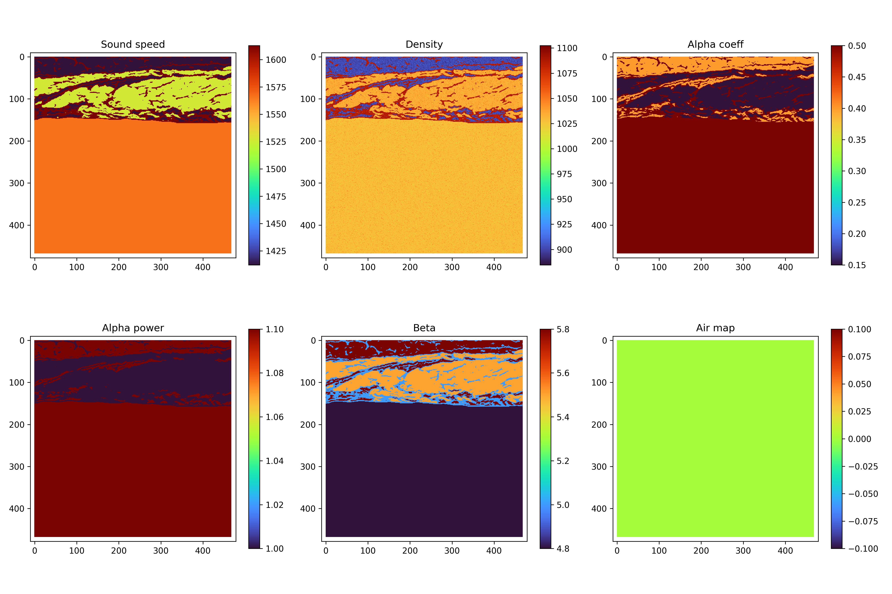 | 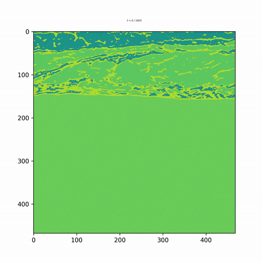 |

Building upon the original Fullwave 2 simulator, Fullwave 2.5 enhances its capabilities to model ultrasound wave propagation in media where **both the attenuation coefficient and exponent can vary spatially**. This enables more accurate simulations of biological tissues, which often exhibit complex attenuation behaviours that cannot be captured by uniform exponent models.

The library is designed with a Python wrapper for ease of use and extensibility, while the core simulation engine is implemented in CUDA/C to leverage high-performance computing on NVIDIA GPUs. Fullwave 2.5 supports 2D and 3D simulations, including multi-GPU execution for enhanced performance.

## Theoretical Background

Fullwave 2.5 models multiple relaxation processes to approximate frequency-dependent power-law attenuation in heterogeneous media.
It solves the stretched-coordinate pressure-velocity formulation using a staggered-grid finite-difference schemes with 8th-order accuracy in space and 4th-order accuracy in time. The stretched-coordinate formulation enables accurate modeling of frequency-dependent power-law attenuation through optimal selection of relaxation parameters.

The following figure illustrates the performance of the attenuation modeling in Fullwave 2.5.
The graph shows a comparison of the target power-law attenuation (red line) and the simulated attenuation (black dots) for various spatially varying attenuation coefficients (α₀ = 0.25, 0.5, and 0.75) and exponents (γ = 0.4, 0.7, 1.0, 1.3, and 1.6).

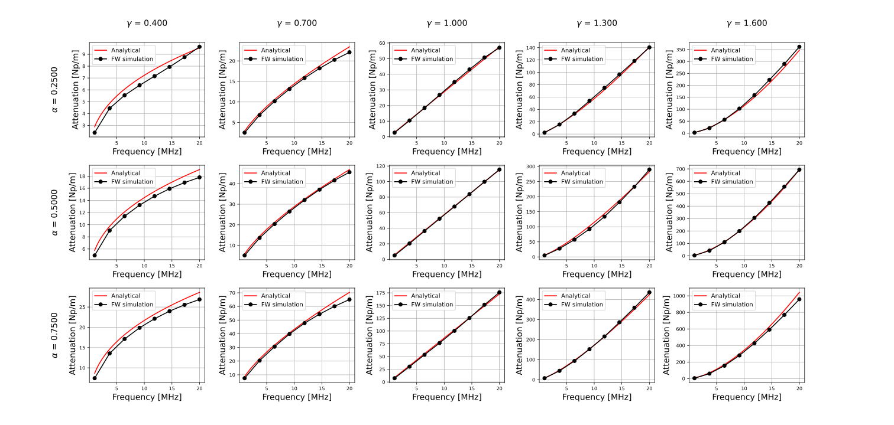

## Citation

Fullwave 2.5 is developed and maintained by [Pinton Lab](https://github.com/pinton-lab) at the University of North Carolina at Chapel Hill.

If you use Fullwave 2.5 in your research, please cite this repository as:

```bibtex
@software{sode-fullwave25,
  author = {Sode, Masashi and Pinton, Gianmarco},
  title = {Fullwave 2.5: Ultrasound wave propagation simulation with heterogeneous power law attenuation modelling capabilities},
  year = {2025},
  month = {oct 29},
  publisher = {GitHub},
  journal = {GitHub repository},
  url = {https://github.com/pinton-lab/fullwave25}
}
```

---

## Hardware prerequisite

- This system operates in a Linux environment.
- This simulation requires an NVIDIA GPU to execute.
- You may need multiple GPUs for 3D simulation.

## Technical recommendation

- We recommend setting up an SSH key for GitHub, if you haven't done already. The repository changes over time to fix bugs and add new features. Cloning through SSH is more convenient than HTTPS in the long run.
  - for ssh key generation
    - please see: [Generating a new SSH key and adding it to the ssh-agent](https://docs.github.com/en/authentication/connecting-to-github-with-ssh/generating-a-new-ssh-key-and-adding-it-to-the-ssh-agent)
  - for ssh key registration to your github account
    - please see: [Adding a new SSH key to your GitHub account](https://docs.github.com/en/authentication/connecting-to-github-with-ssh/adding-a-new-ssh-key-to-your-github-account)
- after that, you can clone the repository through

  ```sh
  git clone git@github.com:pinton-lab/fullwave-python.git
  ```

## Technical references

- If you are not familiar with the tools below, please refer to the provided links.
  - VSCode
    - [Official Visual Studio Code documentation](https://code.visualstudio.com/docs)
    - [Visual Studio Code Tutorial for Beginners by Udacity](https://www.udacity.com/blog/2025/09/visual-studio-code-tutorial-for-beginners-productivity-tips-and-extensions.html)
  - Git
    - [Git Tutorial by GeeksForGeeks](https://www.geeksforgeeks.org/git/git-tutorial/)
    - [Git Tutorial by W3 schools](https://www.w3schools.com/git/default.asp)
    - [Using Git source control in VS Code](https://code.visualstudio.com/docs/sourcecontrol/overview)
  - UV
    - [Python UV: The Ultimate Guide to the Fastest Python Package Manager](https://www.datacamp.com/tutorial/python-uv)

---

## installation

We use [uv](https://docs.astral.sh/uv/) for package project and virtual environment management.

If uv is not installed, run below.

```sh
curl -LsSf https://astral.sh/uv/install.sh | sh
```

Run below to install the development environment.

```sh
git clone git@github.com:pinton-lab/fullwave-python.git
cd fullwave-python
make install-all-extras # for running examples
# or
make install # for the core library installation
```

To test the installation, run

```sh
make test
```

---

## Tutorial: Basic Usage

Please start from [example_simple_plane_wave.ipynb](https://github.com/pinton-lab/fullwave25/blob/main/examples/simple_plane_wave/example_simple_plane_wave.ipynb).

Here are the main steps to run the Fullwave simulation

1. Define the computational grid.
2. Define the properties of the acoustic medium.
3. Define the acoustic source.
4. Define the sensor.
5. Execute the simulation.

## New simulation development instruction

- after the [installation](#installation)
- make a directory for your simulation under your favorite path.
  - e.g. `examples/my_simulation/`
- make a `.py` file or copy the example files below to use the boilerplate.
  - 2D plane wave
    - [examples/simple_plane_wave/simple_plane_wave_demo.py](https://github.com/pinton-lab/fullwave25/blob/main/examples/simple_plane_wave/simple_plane_wave.py)
  - 3D plane wave
    - [examples/wave_3d/simple_plane_wave_3d.py](https://github.com/pinton-lab/fullwave25/blob/main/examples/wave_3d/simple_plane_wave_3d.py)
- after that follow [Usage 2D](#tutorial-basic-usage) to define the simulation code.

## Tutorial: Advanced Usages

Please see the following examples for more advanced usage.

- 2D plane wave
  - Basic usage
    - [Simple plane wave](https://github.com/pinton-lab/fullwave25/blob/main/examples/simple_plane_wave/simple_plane_wave.py)
      - 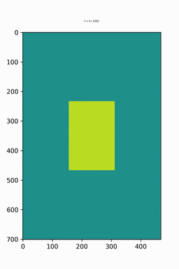
    - [Simple plane wave with air](https://github.com/pinton-lab/fullwave25/blob/main/examples/simple_plane_wave/simple_plane_wave.py)
      - 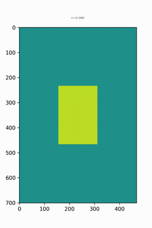
  - Linear transducer
    - [Linear transducer](https://github.com/pinton-lab/fullwave25/blob/main/examples/linear_transducer/linear_transducer.py)
    - [Linear transducer (plane wave transmit) with animation settings](https://github.com/pinton-lab/fullwave25/blob/main/examples/linear_transducer/linear_transducer_animation.py)
      - 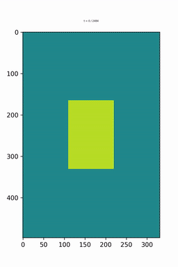
    - [Linear transducer (focused transmit) with animation settings](https://github.com/pinton-lab/fullwave25/blob/main/examples/linear_transducer/linear_transducer_animation.py)
      - 
    - [Linear transducer (focused transmit) with abdominal wall](https://github.com/pinton-lab/fullwave25/blob/main/examples/linear_transducer/linear_transducer.py)
      - 
  - Convex transducer
    - [Convex transducer with abdominal wall](https://github.com/pinton-lab/fullwave25/blob/main/examples/convex_transducer/convex_transducer_abdominal_wall.py)
      - 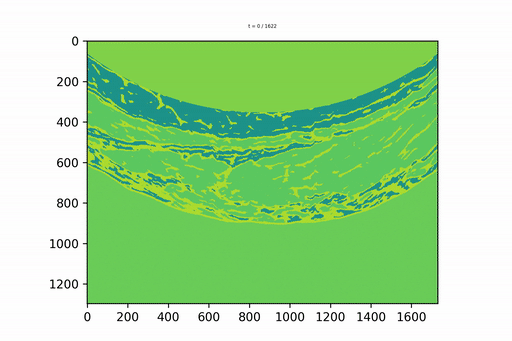
- 3D plane wave

  - Basic usage

    - [Simple plane wave in 3D](https://github.com/pinton-lab/fullwave25/blob/main/examples/wave_3d/simple_plane_wave_3d.py)
      <table>
        <tr>
          <td style="text-align: center;" colspan="2">Computational medium</td>
        </tr>
        <tr>
          <td style="text-align: center;" colspan="2">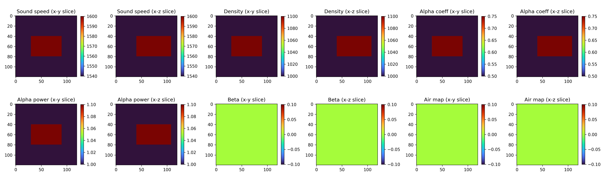</td>
        </tr>
        <tr>
          <td style="text-align: center;" >x-y slice propagation</td>
          <td style="text-align: center;" >x-z slice propagation</td>
        </tr>
        <tr>
          <td style="text-align: center;" ></td>
          <td style="text-align: center;" >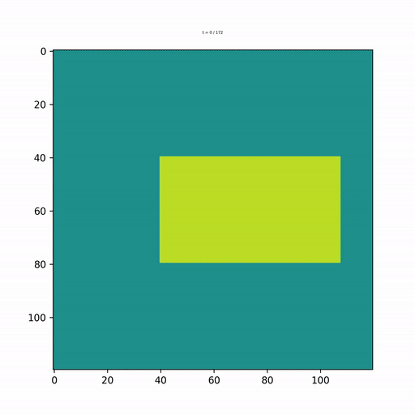</td>
        </tr>
      </table>
    - [Simple plane wave in 3D with air inclusion](https://github.com/pinton-lab/fullwave25/blob/main/examples/wave_3d/simple_plane_wave_3d_with_air.py)
      <table>
        <tr>
          <td style="text-align: center;"  colspan="2">Computational medium with air inclusion</td>
        </tr>
        <tr>
          <td style="text-align: center;"  colspan="2">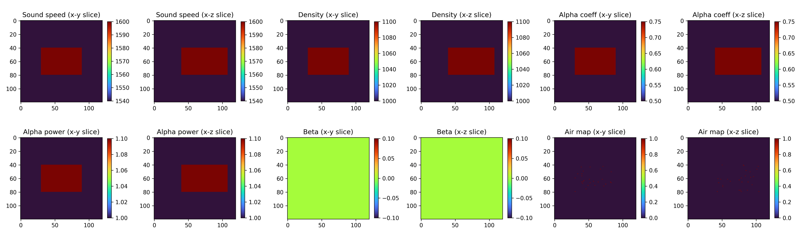</td>
        </tr>
        <tr>
          <td style="text-align: center;" >x-y slice propagation</td>
          <td style="text-align: center;" >x-z slice propagation</td>
        </tr>
        <tr>
          <td style="text-align: center;" >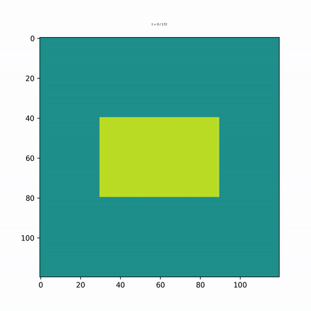</td>
          <td style="text-align: center;" >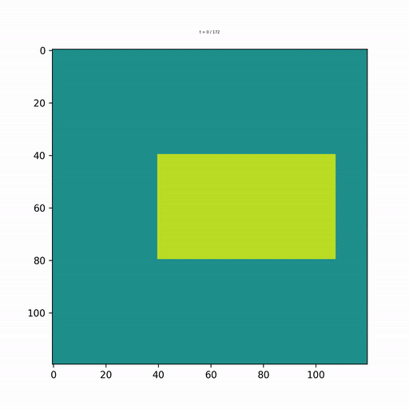</td>
        </tr>
      </table>

- Medium builder usage
  - Medium builder is a utility to create computational medium from simple geometric operations. This is especially useful when you want to create complex heterogeneous media.
  - [simple medium builder usage](https://github.com/pinton-lab/fullwave25/blob/main/examples/medium_builder/medium_builder_example.py)
  - [simple medium builder usage with abdominal wall](https://github.com/pinton-lab/fullwave25/blob/main/examples/medium_builder/medium_builder_abdominal_example.py)
  - [medium builder in 3D](https://github.com/pinton-lab/fullwave25/blob/main/examples/medium_builder/medium_builder_example_3d.py)

---

## Attention

- The simulation grid is defined as follows:
  - (x, y, z) = (depth, lateral, elevational).
    - This order is due to the efficiency of the multiple-GPU execution.
    - Multi-GPU domain decomposition is processed in the depth dimension.
  - The index of the input coordinates (i.e. the acoustic source location) is defined in C-array order (i.e. row-major) within the simulation, regardless of your setup. This is to improve the efficiency of multi-GPU development.
  - This might be confusing, so please be careful when you define the source and source signal definition.
- GPU memory requirement
  - A 3D simulation requires a lot of GPU memory.
    - Please reduce the grid size or use multiple GPUs if you run out of memory.
    - You can check GPU memory usage with the 'nvidia-smi' or 'nvtop' commands.
- Multi-GPU execution
  - The current implementation supports multiple GPU execution in 2D and 3D simulations.
  - Our implementation demonstrates linear performance scaling with the number of GPUs.
- Before 3D simulation:
  - If you want to run a 3D simulation, it is recommended that you start with a 2D simulation first to understand the basic usage.
  - The 3D simulation code is similar to the 2D code, but some plot functions are unavailable in 3D.
  - The 3D simulation takes longer to run, so starting with 2D will help you debug your code faster.

## Note for developers

- Contributions are welcome!
- When developing something new, please create a new branch such as `TYPE/BRANCH_NAME`.
  - TYPE can be `feature`, `bugfix`, `hotfix`, `docs`, `refactor`, `release`, `test`, or `experiment`.
  - `BRANCH_NAME` should be descriptive of the feature or fix you are working on.
  - see also: [GitHub Branching Name Best Practices](https://dev.to/jps27cse/github-branching-name-best-practices-49ei)
- Please write clear and concise commit messages.
- please see [CONTRIBUTING.md](CONTRIBUTING.md) for more details.

---

## Maintainers

- Masashi Sode (GitHub: [MasashiSode](https://github.com/MasashiSode))
- Gianmarco Pinton (GitHub: [gfpinton](https://github.com/gfpinton))
